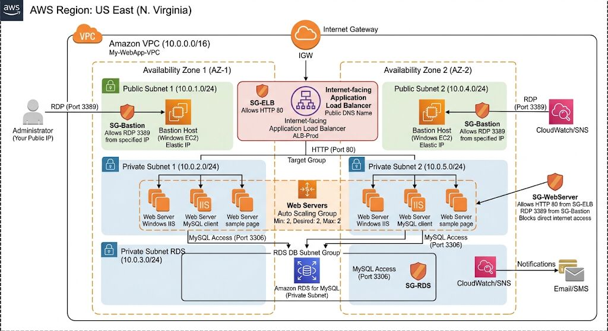
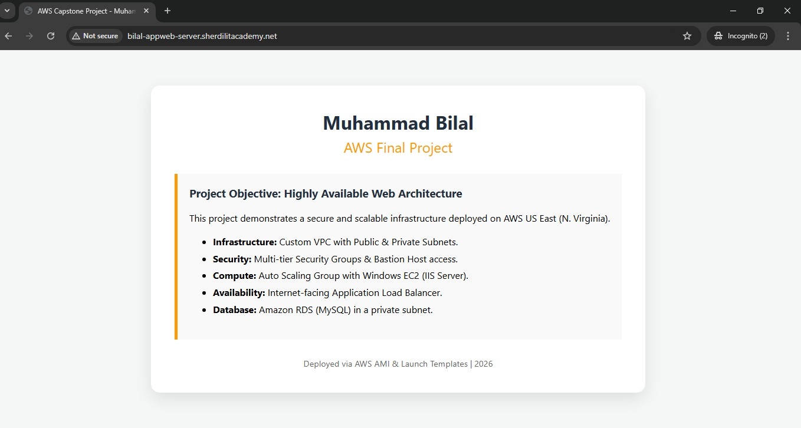
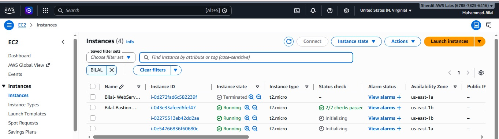
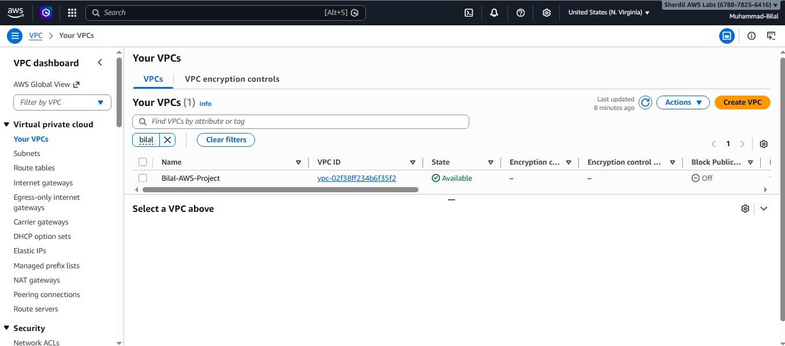
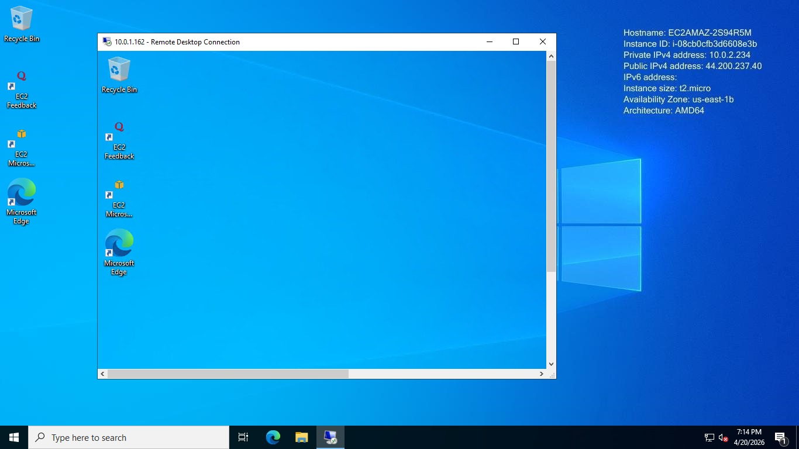

# 🚀 AWS Highly Available Web Application

<div align="center">


**A production-grade, secure, and scalable web application deployed on AWS**  
*Custom VPC · Application Load Balancer · Auto Scaling · RDS MySQL · Route 53*

[🌐 Live Demo](http://bilal-appweb-server.sherdilitacademy.net) · [📐 Architecture](#-architecture) · [🛠️ Setup Guide](#️-deployment-guide)

</div>

---

## 📌 Project Overview

This project demonstrates a **highly available, multi-tier web application** deployed on AWS with a fully custom networking setup. The architecture follows AWS best practices for **security**, **scalability**, and **fault tolerance** — with web servers in private subnets, a Bastion Host for secure access, and an internet-facing ALB handling all incoming traffic.

> 🎯 **Goal:** Deploy a secure web app that remains available even if one Availability Zone goes down, with no direct public access to web servers.

---

## 🏗️ Architecture

<div align="center">



</div>

| Layer | Service | Details |
|-------|---------|---------|
| **Networking** | Amazon VPC | 10.0.0.0/16 — Custom VPC with 5 subnets across 2 AZs |
| **Load Balancing** | Application Load Balancer | Internet-facing, HTTP Port 80, Target Group health checks |
| **Compute** | Amazon EC2 (Windows) | IIS Web Server, t2.micro, private subnets |
| **Scaling** | Auto Scaling Group | Min: 2, Desired: 2, Max: 2 — across AZ-1 & AZ-2 |
| **Database** | Amazon RDS (MySQL) | Private subnet, port 3306, no public access |
| **Secure Access** | Bastion Host | Windows EC2 in public subnet, RDP Port 3389 |
| **DNS** | Amazon Route 53 | Custom domain mapped to ALB DNS |
| **Notifications** | Amazon SNS | CloudWatch alarms → Email/SMS alerts |

---

## 🌐 VPC & Subnet Design

```
Amazon VPC — 10.0.0.0/16 (Bilal-AWS-Project)
│
├── Availability Zone 1 (us-east-1a)
│   ├── Public Subnet 1   — 10.0.1.0/24  → Bastion Host
│   ├── Private Subnet 1  — 10.0.2.0/24  → Web Server (IIS)
│   └── Private Subnet RDS— 10.0.3.0/24  → RDS MySQL
│
└── Availability Zone 2 (us-east-1b)
    ├── Public Subnet 2   — 10.0.4.0/24  → Bastion Host
    └── Private Subnet 2  — 10.0.5.0/24  → Web Server (IIS)
```

---

## 🔐 Security Groups

| Security Group | Inbound Rules | Purpose |
|----------------|---------------|---------|
| **SG-ELB** | HTTP 80 from 0.0.0.0/0 | Load Balancer — public traffic |
| **SG-Bastion** | RDP 3389 from My IP only | Bastion Host — admin access |
| **SG-WebServer** | HTTP 80 from SG-ELB · RDP 3389 from SG-Bastion | Private web servers |
| **SG-RDS** | MySQL 3306 from SG-WebServer | RDS — database access only |

---

## ⚙️ AWS Services Used

- ✅ **Amazon VPC** — Custom networking with public/private subnets
- ✅ **Amazon EC2** — Windows Server with IIS (t2.micro)
- ✅ **Application Load Balancer** — Internet-facing, distributes traffic across AZs
- ✅ **Auto Scaling Group** — Maintains 2 healthy instances across 2 AZs
- ✅ **Amazon RDS (MySQL)** — Private subnet database, port 3306
- ✅ **Bastion Host** — Secure RDP jump server with Elastic IP
- ✅ **Amazon Route 53** — Custom domain → ALB DNS mapping
- ✅ **Amazon SNS** — CloudWatch alarm notifications
- ✅ **AMI (Custom)** — Launch Template with pre-configured IIS

---

## 📸 Screenshots

| | |
|--|--|
|  |  |
| 🌐 **Live Website via Custom Domain** | ⚙️ **EC2 Instances — Auto Scaling Running** |
|  |  |
| 🔷 **Custom VPC — Bilal-AWS-Project** | 🗄️ **RDS MySQL Connected via Bastion** |
|  |  |
| 🔒 **Bastion Host → Private EC2 RDP** | 📐 **Full Architecture Diagram** |

---

## 🛠️ Deployment Guide

### Prerequisites
- AWS Account with IAM permissions
- Key Pair (.pem file) for EC2
- Basic knowledge of AWS Console

### Step 1 — Create VPC & Subnets
```
VPC CIDR:        10.0.0.0/16
Public Subnet 1: 10.0.1.0/24  (us-east-1a)
Public Subnet 2: 10.0.4.0/24  (us-east-1b)
Private Subnet 1: 10.0.2.0/24 (us-east-1a)
Private Subnet 2: 10.0.5.0/24 (us-east-1b)
RDS Subnet:      10.0.3.0/24  (us-east-1a)
```

### Step 2 — Launch Bastion Host
```
AMI:           Windows Server 2019
Instance Type: t2.micro
Subnet:        Public Subnet 1
Security Group: SG-Bastion (RDP 3389 from My IP)
Elastic IP:    Attach for static access
```

### Step 3 — Launch Web Server & Create AMI
```
AMI:           Windows Server 2019
Instance Type: t2.micro
Subnet:        Private Subnet 1
Install:       IIS Web Server
Configure:     Default website with project page
Run Sysprep:   ⚠️ Required before creating custom AMI
Create AMI:    Use for Launch Template
```

### Step 4 — Configure Application Load Balancer
```
Type:          Application Load Balancer
Scheme:        Internet-facing
Listener:      HTTP Port 80
Target Group:  HTTP Port 80, Health Check Path: /
AZs:           us-east-1a, us-east-1b
```

### Step 5 — Create Auto Scaling Group
```
Launch Template: Use custom AMI
Min Capacity:    2
Desired:         2
Max Capacity:    4
Subnets:         Private Subnet 1 + Private Subnet 2
```

### Step 6 — Set Up RDS MySQL
```
Engine:    MySQL 8.0
Class:     db.t3.micro
Subnet:    Private RDS Subnet Group
SG:        SG-RDS (3306 from SG-WebServer only)
Public:    NO
```

### Step 7 — Configure Route 53
```
Record Type: A (Alias)
Value:       ALB DNS Name
TTL:         300
```

---

## 🐛 Challenges & Solutions

### 1. Target Group — Unhealthy Instances
| | |
|--|--|
| **Problem** | ALB showed all targets as unhealthy |
| **Root Cause** | IIS default site not running + wrong health check path |
| **Fix** | Started IIS service, set health check path to `/` |

### 2. 504 Gateway Timeout
| | |
|--|--|
| **Problem** | Browser showed 504 from Load Balancer |
| **Root Cause** | Security Group on web servers blocking HTTP 80 from ALB SG |
| **Fix** | Updated SG-WebServer inbound: HTTP 80 source = SG-ELB |

### 3. RDP Password Failure After Custom AMI
| | |
|--|--|
| **Problem** | Could not decrypt RDP password for instances from custom AMI |
| **Root Cause** | Sysprep was not run before creating the AMI |
| **Fix** | Re-ran Sysprep on source instance, rebuilt AMI, updated Launch Template |

---

## 📊 Results

```
✅ Application live at:  bilal-appweb-server.sherdilitacademy.net
✅ Load Balancer:        Distributing traffic across 2 AZs
✅ Auto Scaling:         2 healthy instances always running
✅ Database:             RDS MySQL accessible only from private subnet
✅ Security:             Zero direct public access to web servers
✅ Monitoring:           SNS notifications configured via CloudWatch
```

---

## 📚 Key Learnings

- **Sysprep is mandatory** before creating a custom Windows AMI — skipping it breaks RDP password decryption
- **Security Group chaining** — ALB → WebServer → RDS creates a clean, layered security model
- **Health check path** must match an existing route on IIS — a misconfigured path silently fails all targets
- **Private subnets** need a NAT Gateway if instances require outbound internet access
- **Multi-AZ design** is the foundation of high availability on AWS

---

## 👨‍💻 Author

**Muhammad Bilal**  
Cloud Engineer | AWS | Pakistan  

[](https://linkedin.com/in/muhammad-bilal-977001399)
[](https://fiverr.com/bilal_awscloud)
[](https://github.com/MuhammadBilal-devOps)

---

<div align="center">

⭐ **If this project helped you, please give it a star!** ⭐

</div>
